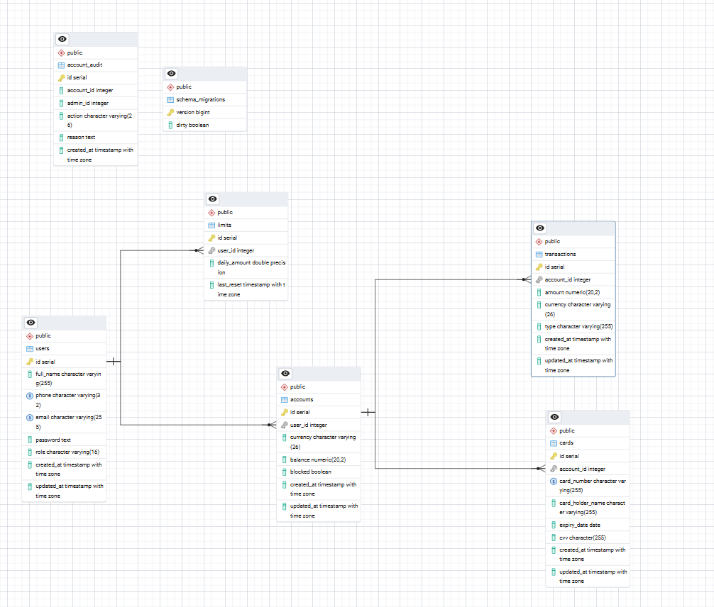

# 🏦 MiniBank - Banking API Service

[](https://golang.org)
[](https://postgresql.org)
[](https://redis.io)
[](https://jwt.io)



**MiniBank** - это современный REST API для банковских операций, построенный на Go с использованием Clean Architecture принципов. Проект демонстрирует best practices в разработке финансовых систем с акцентом на безопасность, производительность и надежность.

## 🚀 Ключевые возможности

### 💳 **Банковские операции**
- Регистрация и аутентификация пользователей
- Создание банковских счетов в разных валютах (TJS, USD, EUR)
- Автоматическое создание карт при регистрации
- Пополнение, снятие и переводы средств
- Система дневных лимитов с комиссиями за превышение

### 🔐 **Безопасность**
- JWT аутентификация с refresh tokens
- Role-based access control (RBAC)
- bcrypt хеширование паролей
- Защита от SQL injection через prepared statements
- Атомарные банковские транзакции

### 👨‍💼 **Административные функции**
- Блокировка/разблокировка счетов
- Аудит логи всех операций
- Управление пользователями

### 📊 **Мониторинг и логирование**
- Structured logging с zerolog
- Comprehensive error handling
- Database operation tracing

## 🏗️ Архитектура

Проект следует принципам **Clean Architecture**:

```
├── cmd/                    # Application entry point
├── config/                 # Database configuration
├── internal/
│   ├── app/               # Application initialization
│   ├── controller/        # HTTP handlers (Presentation layer)
│   ├── service/          # Business logic layer
│   ├── repository/       # Data access layer
│   ├── domain/           # Entities and contracts
│   ├── errs/            # Centralized error definitions
│   ├── logger/          # Logging configuration
│   ├── redis/           # Redis connection
│   └── utils/           # Utility functions
└── migration/            # Database migrations
```

### 🔄 **Dependency Injection Flow**
```
main() → app.AppRun() → NewController(NewService(NewRepository(db)))
```

## 🛠️ Технологический стек

- **Backend**: Go 1.24
- **Web Framework**: Gin
- **Database**: PostgreSQL with sqlx
- **Cache**: Redis
- **Authentication**: JWT with refresh tokens
- **Logging**: zerolog (structured logging)
- **Password Hashing**: bcrypt
- **Database Migration**: Custom SQL migrations

## 📋 Требования

- Go 1.24+
- PostgreSQL 15+
- Redis 7+

## 🚀 Быстрый старт

### 1. Клонирование репозитория
```bash
git clone https://github.com/MMII0220/MiniBank.git
cd MiniBank
```

### 2. Настройка переменных окружения
```bash
export JWT_SECRET_KEY="your-super-secret-jwt-key"
export DB_HOST="localhost"
export DB_PORT="5432"
export DB_USER="postgres"
export DB_PASSWORD="password"
export DB_NAME="minibank"
export REDIS_HOST="localhost"
export REDIS_PORT="6379"
```

### 3. Установка зависимостей
```bash
go mod download
```

### 4. Запуск миграций
```sql
-- Выполните SQL файлы из папки migration/ в порядке нумерации
-- Или используйте ваш любимый migration tool
```

### 5. Запуск приложения
```bash
go run cmd/main.go
```

Сервер запустится на `http://localhost:7999`

## 📚 API Documentation

### 🔐 Authentication

#### Регистрация пользователя
```http
POST /auth/register
Content-Type: application/json

{
  "full_name": "John Doe",
  "phone": "+992123456789",
  "email": "john@example.com",
  "password": "securePassword123"
}
```

#### Вход в систему
```http
POST /auth/login
Content-Type: application/json

{
  "email": "john@example.com",
  "password": "securePassword123"
}
```

**Response:**
```json
{
  "access_token": "eyJhbGciOiJIUzI1NiIs...",
  "refresh_token": "eyJhbGciOiJIUzI1NiIs...",
  "token_type": "Bearer",
  "expires_in": 900
}
```

#### Обновление токена
```http
POST /auth/refresh
Content-Type: application/json

{
  "refresh_token": "eyJhbGciOiJIUzI1NiIs..."
}
```

### 💰 Banking Operations

Все операции требуют авторизации: `Authorization: Bearer <access_token>`

#### Пополнение счета
```http
POST /api/deposit
Content-Type: application/json
Authorization: Bearer <access_token>

{
  "card_number": "4242424242424242",
  "amount": 1000,
  "currency": "TJS"
}
```

#### Снятие средств
```http
POST /api/withdraw
Content-Type: application/json
Authorization: Bearer <access_token>

{
  "card_number": "4242424242424242",
  "amount": 500,
  "currency": "TJS"
}
```

#### Перевод средств
```http
POST /api/transfer
Content-Type: application/json
Authorization: Bearer <access_token>

{
  "to_card_number": "4242424242424243",
  "amount": 300,
  "currency": "TJS"
}
```

#### История транзакций
```http
GET /api/history
Authorization: Bearer <access_token>
```

### 👨‍💼 Admin Operations

Требуют роль `admin`:

#### Блокировка счета
```http
POST /admin/blockUnblock/123
Content-Type: application/json
Authorization: Bearer <admin_access_token>

{
  "block": true,
  "reason": "Suspicious activity detected"
}
```

#### Получение аудит логов
```http
GET /admin/getAuditLogs
Authorization: Bearer <admin_access_token>
```

## 🔧 Конфигурация

### Валюты и курсы
```go
// В service/limit.go
var currencyRates = map[string]float64{
    "TJS": 1.0,   // базовая валюта
    "USD": 9.21,  // 1 USD = 9.21 TJS
    "EUR": 10.72, // 1 EUR = 10.72 TJS
}
```

### Лимиты и комиссии
- **Дневной лимит**: 1000 TJS (по умолчанию)
- **Комиссия за превышение**: 2%
- **TTL токенов**: Access - 15 минут, Refresh - 7 дней

## 🛡️ Безопасность

### Реализованные меры защиты:
- ✅ JWT аутентификация с короткими TTL
- ✅ bcrypt хеширование паролей (cost 10)
- ✅ RBAC авторизация
- ✅ Prepared statements против SQL injection
- ✅ Скрытие технических ошибок от пользователей
- ✅ Атомарные транзакции для финансовых операций
- ✅ Валидация входных данных
- ✅ Structured logging для аудита

### Error Handling Strategy:
```go
// Repository → Service → Controller
// Технические ошибки → Бизнес ошибки → HTTP ответы
Repository: "sql: no rows in result set"
↓
Service: "invalid credentials" 
↓
Controller: {"error": "Invalid email or password"}
```

## 🧪 Тестирование

```bash
# Запуск тестов
go test ./...

# Тесты с покрытием
go test -cover ./...

# Бенчмарки
go test -bench=. ./...
```

## 📈 Performance Features

- **Connection pooling** для PostgreSQL
- **Redis caching** для часто используемых данных
- **Prepared statements** для оптимизации SQL запросов
- **Structured logging** для минимального overhead
- **Efficient JSON marshaling** с помощью Gin

## 🚀 Deployment

### Docker (будущая версия)
```dockerfile
FROM golang:1.24-alpine AS builder
WORKDIR /app
COPY . .
RUN go build -o minibank cmd/main.go

FROM alpine:latest
RUN apk --no-cache add ca-certificates
WORKDIR /root/
COPY --from=builder /app/minibank .
CMD ["./minibank"]
```

## 🤝 Contributing

1. Fork проект
2. Создайте feature branch (`git checkout -b feature/amazing-feature`)
3. Commit изменения (`git commit -m 'Add amazing feature'`)
4. Push в branch (`git push origin feature/amazing-feature`)
5. Создайте Pull Request

## 📄 License

This project is licensed under the MIT License - see the [LICENSE](LICENSE) file for details.

## 👨‍💻 Author

**MMII0220** - [GitHub Profile](https://github.com/MMII0220)

---

## 💡 Демонстрация для собеседования

### Архитектурные решения:
- **Clean Architecture** с четким разделением слоев
- **Dependency Injection** для тестируемости
- **Error handling** на каждом уровне с трансляцией ошибок
- **Structured logging** для observability

### Финтех особенности:
- **Атомарные транзакции** для денежных операций
- **Система лимитов** с динамическими комиссиями
- **Мультивалютность** с конвертацией курсов
- **Аудит логи** для compliance

### Безопасность:
- **JWT refresh token pattern** для web безопасности
- **Role-based permissions** для разграничения доступа
- **Input validation** и **sanitization**
- **Secret management** через environment variables

Этот проект демонстрирует production-ready подход к разработке финансовых API с акцентом на безопасность, производительность и maintainability.